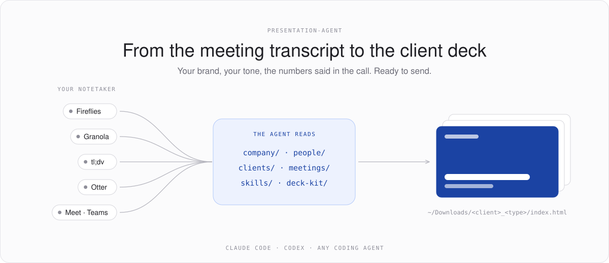
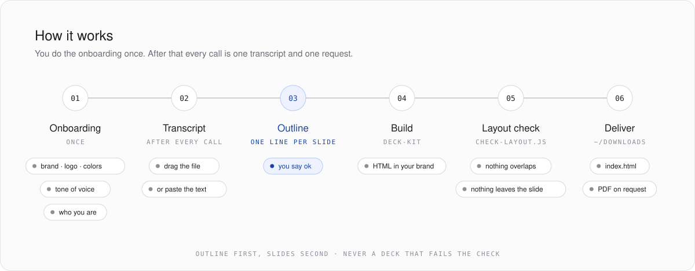
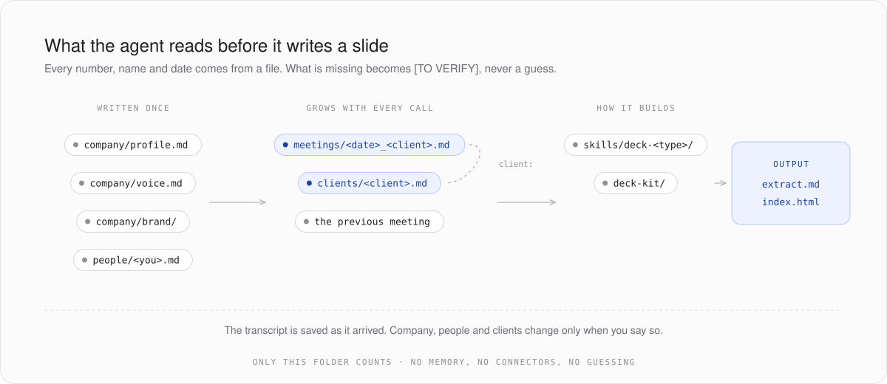
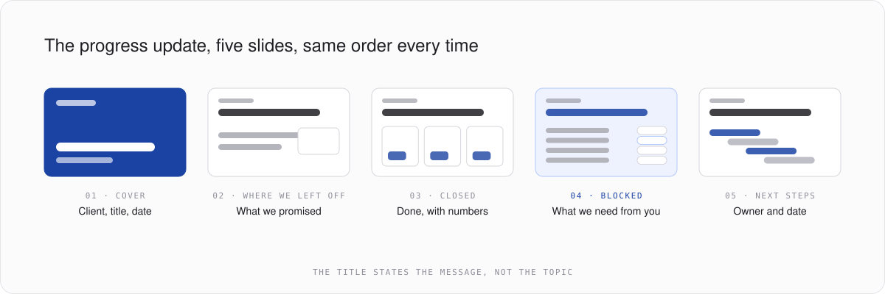
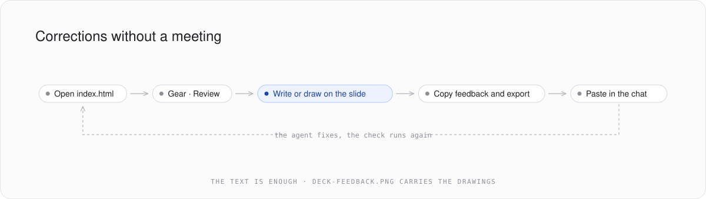

<!-- markdownlint-disable MD033 MD041 -->
<div align="center">



# presentation-agent

**You finish a meeting with a client. You put the transcript in this repo. The agent hands you the presentation, with your brand and the numbers taken from the meeting.**

It works in your language: write to it in Italian, Spanish or English, and it answers and builds the slides in that language.


</div>

---

> **The idea in three lines.**
> The slides after a client call always say the same three things: what was done, what is blocked, what happens next.
> The facts are already in the transcript, and your brand and tone never change.
> So the agent writes the deck, and you only check it.

## Contents

1. [What you need](#what-you-need)
2. [How it works](#how-it-works)
3. [What the agent reads](#what-the-agent-reads)
4. [The progress update](#the-progress-update)
5. [Corrections](#corrections)
6. [How it is organized](#how-it-is-organized)
7. [A new presentation type](#a-new-presentation-type)
8. [Your copy stays yours](#your-copy-stays-yours)

---

## What you need

| | Why |
| --- | --- |
| **A coding agent** | [Claude Code](https://claude.com/claude-code), Codex or similar. It reads the files and writes the presentation. You need its subscription. |
| **[GitHub](https://github.com)** | You download the repo from here. You need an account only if you want to keep your copy online. |
| **Your brand guidelines** | Logo, colors, fonts. The logo and two colors are enough. |
| **A notetaker** | Fireflies, Granola, tl;dv, Otter, or the Google Meet or Teams transcript. You need the transcript as text. |
| **Google Chrome** | For the layout check and the PDF export. |
| **[Node.js](https://nodejs.org)** | To run the layout check and the export. Then `cd deck-kit && npm install`, once. |

---

## How it works



### 1. Download the repo and do the onboarding

On GitHub press **Code**, then **Download ZIP**, and unzip the folder: it is called `presentation-agent-main`. With git:

```bash
git clone https://github.com/CommerceClarity/presentation-agent.git
cd presentation-agent
claude
```

The instructions for the agent are in `CLAUDE.md` (Claude Code) and `AGENTS.md` (Codex and the others), same text.

The first time, the agent sees the repo is empty and asks a few questions: what presentation you want, your company, what you do, logo, colors, fonts, how you write, who you are. With your answers it writes `company/` and `people/`. You do it once, it takes five minutes.

### 2. Upload the meeting transcript

Export the transcript from your notetaker and drag the file into the chat, or paste the text. The agent saves it in `meetings/YYYY-MM-DD_<client>.md` and, if the client is new, creates `clients/<client>.md` with what the meeting says. It shows you what it saved and asks you to fill in what is missing.

### 3. Ask for the presentation

> Make me the progress update for today's meeting with Rossi.

The agent reads company, client and meeting. It proposes the outline, waits for your ok, builds the slides, checks the layout and puts the folder in your Downloads. Open `index.html` in the browser. The folder already holds style, logo and fonts, so you can send it as it is.

---

## What the agent reads



- **Every number, name and date comes from a file.** If a fact the slide needs is missing, it writes `[TO VERIFY]` and tells you when it delivers.
- **Before the slides it writes an extract**, `extract.md`: every fact with the transcript sentence it comes from.
- **Only this folder counts.** The agent does not use local memory, connectors or the name the session runs under. If it is not in the repo and you did not say it, it asks.

---

## The progress update



The deck you send the client after the progress call. The client reads it in two minutes and knows what was done, what you are waiting for from them, and what happens before the next meeting. Same five slides, same order, every time. Full spec in [`skills/deck-progress-update/SKILL.md`](skills/deck-progress-update/SKILL.md).

---

## Corrections



Open the presentation, gear icon at the bottom left, **Review**. Write or draw on the slides, press **Copy feedback and export** and paste the text into the chat. The text is enough. An image `deck-feedback.png` with your drawings is downloaded too: opened from your disk it shows the drawings but not the slide behind them.

---

## How it is organized

```text
presentation-agent/
├── CLAUDE.md · AGENTS.md   # the file the agent reads first (same text)
├── company/                # your company: profile, voice, brand (written by the onboarding)
├── people/                 # who uses the repo: role, language, how they write
├── clients/                # one file per client
├── meetings/               # one file per meeting, with the link to the client
├── skills/                 # onboarding + one presentation type per folder
│   ├── onboarding/
│   └── deck-progress-update/
├── deck-kit/               # style, navigation, layout check, PDF export
└── examples/               # presentations kept as a reference
```

Meetings and clients are separate. A meeting points to its client with the `client:` field, so all the meetings of a client are one search away. The slide engine is documented in [`deck-kit/README.md`](deck-kit/README.md).

---

## A new presentation type

Need a kickoff, a proposal, anything else? Ask the agent. It copies `skills/deck-progress-update/` to `skills/deck-<type>/`, asks you what each slide must say, rewrites the outline and adds the type to `CLAUDE.md` and `AGENTS.md`. It never builds a presentation without its skill.

---

## Your copy stays yours

After the onboarding the folder holds your company's data, your clients and the meeting transcripts. If you upload it to GitHub, make it **private**.

<sub>Built by CommerceClarity.</sub>
